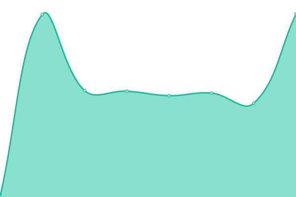

# [📈 Live Status](https://status.authenticityleads.com): <!--live status--> **🟩 All systems operational**

This repository contains the open-source uptime monitor and status page for [Authenticity Leads](https://status.authenticityleads.com), powered by [Upptime](https://github.com/upptime/upptime).

With [Upptime](https://upptime.js.org), you can get your own unlimited and free uptime monitor and status page, powered entirely by a GitHub repository. We use [Issues](https://github.com/AuthenticityLeads/status-page/issues) as incident reports, [Actions](https://github.com/AuthenticityLeads/status-page/actions) as uptime monitors, and [Pages](https://status.authenticityleads.com) for the status page.

<!--start: status pages-->
<!-- This summary is generated by Upptime (https://github.com/upptime/upptime) -->
<!-- Do not edit this manually, your changes will be overwritten -->
<!-- prettier-ignore -->
| URL | Status | History | Response Time | Uptime |
| --- | ------ | ------- | ------------- | ------ |
|  [Main site](https://authenticityleads.com) | 🟩 Up | [main-site.yml](https://github.com/AuthenticityLeads/status-page/commits/HEAD/history/main-site.yml) | 

 2894ms
     
 | 

<a href="https://status.authenticityleads.com/history/main-site">100.00%</a>
    

|  [Backoffice](https://app.authenticityleads.com/) | 🟩 Up | [backoffice.yml](https://github.com/AuthenticityLeads/status-page/commits/HEAD/history/backoffice.yml) | 

 129ms
     
 | 

<a href="https://status.authenticityleads.com/history/backoffice">100.00%</a>
    

|  [API](https://api.authenticityleads.com) | 🟩 Up | [api.yml](https://github.com/AuthenticityLeads/status-page/commits/HEAD/history/api.yml) | 

 721ms
     
 | 

<a href="https://status.authenticityleads.com/history/api">100.00%</a>
    

|  [Backend(clone API)](https://backendprod.authenticityleads.com) | 🟩 Up | [backend-clone-api.yml](https://github.com/AuthenticityLeads/status-page/commits/HEAD/history/backend-clone-api.yml) | 

 706ms
     
 | 

<a href="https://status.authenticityleads.com/history/backend-clone-api">100.00%</a>
    

|  [Lambda](https://lambda-prod.authenticityleads.com) | 🟩 Up | [lambda.yml](https://github.com/AuthenticityLeads/status-page/commits/HEAD/history/lambda.yml) | 

 390ms
     
 | 

<a href="https://status.authenticityleads.com/history/lambda">100.00%</a>
    

|  [Snippet](https://code.authenticityleads.com/js/modules/Api.mjs) | 🟩 Up | [snippet.yml](https://github.com/AuthenticityLeads/status-page/commits/HEAD/history/snippet.yml) | 

 253ms
     
 | 

<a href="https://status.authenticityleads.com/history/snippet">100.00%</a>
    

<!--end: status pages-->

[**Visit our status website →**](https://status.authenticityleads.com)

## 📄 License

- Powered by: [Upptime](https://github.com/upptime/upptime)
- Code: [MIT](./LICENSE) © [Anand Chowdhary](https://anandchowdhary.com), supported by [Pabio](https://pabio.com)
- Data in the `./history` directory: [Open Database License](https://opendatacommons.org/licenses/odbl/1-0/)
